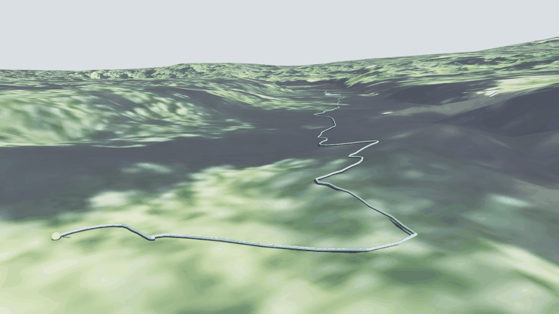

# River Drifter Digital Twin

*Real-world GPS/IMU sensor fusion, physics validation, and georeferenced 3-D visualization in NVIDIA Isaac Sim*



[](https://www.python.org)
[](https://developer.nvidia.com/isaac-sim)
[](tests/)
[](README.md#phase-by-phase-implementation-plan)

A robotics-grade digital twin of a custom-built GPS/IMU river drifter. The system ingests raw multi-modal sensor data from an Arduino floating platform, reconstructs the 3-D trajectory through coordinate transforms and EKF-based state estimation, validates it against a Newton drag/buoyancy physics simulation, and renders the full scene inside a photorealistic Cesium World Terrain environment. The USD visualization serves as a ground-truth inspection tool for sim-to-real analysis — not the primary deliverable.

**Robotics domains:** Localization · State Estimation · Sensor Fusion · Sim-to-Real Validation · Motion Modeling · Perception

---

## Highlights

| | |
|---|---|
| **3,553** GPS/IMU samples from live Eno River deployment | **< 0.1 m** LLA→ENU coordinate transform error (pyproj) |
| **< 1 s** to pre-bake 12,600+ USD animation frames | **33** unit tests — sensor ingestion, geo-conversion, EKF, metrics |
| **6-layer** modular architecture (sensor → state → physics → viz) | **3 cameras** — orbital overview, chase, onboard POV |

---

## Tech stack

| Category | Technology |
|---|---|
| Simulation | NVIDIA Isaac Sim, USD (Universal Scene Description) |
| Geospatial | WGS84→ENU (pyproj ECEF, < 0.1 m error), Cesium World Terrain |
| State estimation | Extended Kalman Filter, Mahalanobis outlier gating |
| Data processing | pandas, numpy, PyYAML |
| Visualization | USD BasisCurves, omni.ui control panel, matplotlib, plotly |
| Firmware | Arduino, LSM9DS1 9-axis IMU, TinyGPS++, LoRa, Madgwick AHRS |
| Testing | pytest (33 tests, no Isaac Sim required) |

---

## Repository layout

```
Flood-Modelling/
├── configs/
│   └── default.yaml                EKF, physics, noise, and metrics hyperparameters
├── exts/
│   ├── drifter_vis/                Isaac Sim Kit extension
│   │   ├── extension.toml          Kit extension manifest and dependency declarations
│   │   └── src/                    Python source modules
│   │       ├── data_loader.py      Sensor Ingestion Layer
│   │       ├── geo_converter.py    State Estimation — LLA→ENU, attitude estimation
│   │       ├── state_estimator.py  EKF sensor fusion  [Phase 3]
│   │       ├── physics_validator.py Motion Modeling + Validation Layer
│   │       ├── metrics.py          Evaluation metrics  [Phase 4]
│   │       ├── scene_builder.py    USD stage construction
│   │       ├── animator.py         USD time-sample baking
│   │       ├── camera_manager.py   Camera keyframe baking
│   │       ├── ui_panel.py         omni.ui control panel
│   │       ├── terrain_draper.py   RTX raycast terrain draping
│   │       ├── extension.py        IExt orchestrator
│   │       └── utils.py            Shared constants and colour maps
│   ├── docs/
│   │   └── OVERVIEW.md             Architecture and developer guide
│   └── *.csv                       Eno River sensor logs (7 deployments)
├── tests/
│   ├── test_data_loader.py
│   ├── test_geo_converter.py
│   ├── test_metrics.py
│   └── test_state_estimator.py
├── visualizations/
│   ├── graphs/                     Static 2-D trajectory images (matplotlib)
│   ├── scripts/                    Plot generation scripts
│   └── README.md
├── assets/
│   └── demo.gif                    Simulation preview (above)
├── run_standalone.py               Script Editor / headless entry point
└── requirements.txt
```

---

## System architecture — six layers

### Layer 1 — Sensor Ingestion (`data_loader.py`)

Consumes raw multi-modal sensor logs from the Arduino firmware and produces a clean,
time-aligned DataFrame for downstream processing.

| Input | Processing | Output |
|---|---|---|
| GPS: Lat, Lon, Alt, Speed | Dropout removal (Lat=Lon=0 mask) | `time_s`, `speed_ms` |
| IMU: AX/AY/AZ, GX/GY/GZ, MX/MY/MZ | Unit normalisation (mph→m/s, ms→s) | `dt_s`, `accel_mag` |
| Arduino `millis()` counter | Segment detection (1 s backward-jump threshold) | `segment_id`, `heading_deg` |

Robotics relevance: raw-sensor → structured-state pipeline analogous to ROS sensor drivers; outlier rejection at ingestion prevents filter divergence downstream.

### Layer 2 — State Estimation (`geo_converter.py`, `state_estimator.py`)

Reconstructs the 6-DOF drifter state from heterogeneous sensor streams.

**Implemented (`geo_converter.py`):**
- WGS84 LLA → local ENU Cartesian (pyproj ECEF path; < 0.1 m error at 350 m baseline)
- Attitude estimation: roll and pitch from debiased accelerometer via `atan2`; yaw from
  GPS-derived heading — a single-epoch complementary filter
- Bobbing model: sinusoidal vertical offset from buoy oscillation frequency

**Planned (`state_estimator.py` — Phase 3):**
- Extended Kalman Filter (EKF) over state vector `[x, y, vx, vy, ax, ay]`
- GPS position as measurement update; IMU as process model propagation
- Noise parameters (Q, R matrices) tunable in `configs/default.yaml`
- Outputs: filtered trajectory, covariance envelope, filter-vs-raw RMSE comparison

Robotics relevance: sensor fusion, localization, state estimation — core EKF/UKF skills expected in robotics perception and navigation roles.

### Layer 3 — Environment Modeling (`scene_builder.py`)

Builds the georeferenced simulation environment in Isaac Sim USD.

- Cesium World Terrain + Bing Maps satellite imagery (georeferenced 3-D tiles)
- Falls back to flat water plane when Cesium is unavailable
- Speed-gradient BasisCurves trajectory (viridis colour map: slow=dark-blue → fast=yellow)
- Physics discrepancy overlay (blue=low → red=high divergence)
- Drifter mesh prim at origin with time-sampled Xform poses

Robotics relevance: georeferenced digital twin used as ground-truth inspection for trajectory and state validation.

### Layer 4 — Motion Modeling (`physics_validator.py`)

Forward-Euler dynamics model of the drifter in a river flow field.

```
State:    position (east, north), velocity (vx, vz)
Forces:   river current drag, fluid viscous drag, buoyancy (vertical equilibrium)
Model:    F_drag = 0.5 · ρ · Cd · A · |v_rel|² · v̂_rel
Current:  estimated from first 20 GPS-derived velocity vectors (bulk-flow proxy)
```

Physical parameters (tunable in `configs/default.yaml`):

| Parameter | Value |
|---|---|
| Mass | 1.5 kg |
| Radius | 0.15 m |
| Drag coefficient Cd | 0.82 (cylinder) |
| Freshwater density ρ | 1000 kg/m³ |

Output: simulated trajectory `(sim_east, sim_north)` alongside the recorded path, plus a
per-point discrepancy array (metres) used to colour-code the physics overlay.

Robotics relevance: controls and dynamics modeling; equivalent to kinematic/dynamic model validation in sim-to-real transfer and model-based control design.

### Layer 5 — Validation and Metrics (`metrics.py`)

Quantitative evaluation of state estimation and physics model quality.

| Metric | Definition | Target |
|---|---|---|
| Trajectory RMSE | `√(mean((x̂−x)²+(ŷ−y)²))` vs raw GPS | < 0.5 m after EKF |
| EKF improvement | RMSE(EKF) / RMSE(raw GPS) | ≥ 20 % reduction |
| Velocity error | `mean(‖v̂−v_GPS‖)` across run | < 0.1 m/s |
| Acceleration residual | `mean(‖â−a_IMU_debiased‖)` | < 0.05 m/s² |
| Physics discrepancy | Mean Euclidean distance (recorded vs simulated) | Characterised per segment |
| Drift divergence | Final position error of physics simulation | Quantifies flow-field simplification |
| Path curvature peak | `max(κ)` along run | Identifies rapids / eddy events |

All metrics are logged to stdout and optionally written to `data/metrics_<run>.csv` for regression testing and comparison across parameter sweeps.

### Layer 6 — Visualization and Interaction (`scene_builder.py`, `animator.py`, `camera_manager.py`, `ui_panel.py`)

Isaac Sim USD stage with pre-baked time samples and interactive control panel.

- 3,553 positions baked as USD time samples in < 1 s startup time
- Live per-frame debug arrows: blue = velocity vector, red = acceleration vector
- Three cameras: orbital overview (pre-baked 120 s orbit), third-person chase, onboard POV
- RTX raycast terrain draping: trajectory lifted onto Cesium georeferenced terrain
- `omni.ui` control panel: file picker, play/pause/stop, speed slider (0.1–10×), camera
  selector, live GPS/speed/altitude readouts, physics overlay toggle

---

## Phase-by-phase implementation plan

### Phase 1 — Sensor Ingestion and Coordinate Frame (complete)

- [x] Arduino firmware: GPS + IMU + LoRa logging at ~5 Hz
- [x] `DrifterDataLoader`: dropout removal, unit normalisation, time monotonisation, segment detection
- [x] `GeoConverter`: WGS84 → ENU (spherical and pyproj paths), attitude from accel + GPS heading
- [x] Unit tests: 33 passing (GPS dropout, speed conversion, LLA→ENU accuracy, time normalisation)

### Phase 2 — Physics Dynamics Model and USD Visualisation (complete)

- [x] `PhysicsValidator`: forward-Euler buoyancy + drag simulation
- [x] `compute_discrepancy`: per-point Euclidean distance, mean/max/95th-percentile logging
- [x] `SceneBuilder`: USD stage with Cesium terrain, speed-gradient and physics-overlay trajectories
- [x] `Animator`: pre-baked USD time samples + debug draw arrows
- [x] `CameraManager`: overview, chase, onboard cameras with baked keyframes
- [x] `TerrainDraper`: RTX raycast integration for Cesium terrain draping
- [x] `UiPanel` + `extension.py`: omni.ui control panel, Kit IExt orchestrator

### Phase 3 — EKF State Estimation and Sensor Fusion (planned)

- [ ] `StateEstimator` class: 6-state EKF `[x, y, vx, vy, ax, ay]`
  - Process model: constant-acceleration kinematics; IMU as prediction input
  - Measurement model: GPS position update; GPS speed as velocity measurement
  - Tunable Q (process noise), R (measurement noise) in `configs/default.yaml`
- [ ] Noise characterisation: GPS positional noise (σ ≈ 2–5 m CEP), IMU bias estimation
- [ ] Outlier rejection: Mahalanobis-distance gate on GPS updates (reject |innovation| > 3σ)
- [ ] Drift detection: flag segments where heading diverges > 30° from flow-field estimate

### Phase 4 — Metrics, Curvature Analysis, and Flow Field Modeling (planned)

- [ ] `Metrics` class: RMSE, velocity error, acceleration residuals, drift divergence, filter
  improvement ratio — written to CSV for regression comparison
- [ ] Path curvature: `κ = |v × a| / |v|³` per sample; identify rapids, bends, eddies
- [ ] Flow field: 2-D velocity grid from GPS-derived vectors replacing constant-current approximation
- [ ] Predicted-vs-actual overlays: EKF estimate, raw GPS, physics simulation as three
  simultaneous trajectory prims with distinct colour coding

### Phase 5 — Sim-to-Real Analysis and Reporting (planned)

- [ ] Sweep Cd, mass, and flow-field resolution; report RMSE sensitivity
- [ ] Export per-run metrics to JSON for automated CI comparison
- [ ] Headless batch mode: full pipeline (ingest → EKF → physics → metrics) without Isaac Sim

---

## Quick start

### Script Editor (Isaac Sim)

1. Open Isaac Sim
2. **Window → Script Editor**
3. Open `run_standalone.py` → click **▶ Run**
4. Press **Play** in the timeline

### Extension (Kit)

Add `exts/` to Kit search paths:

```toml
# ~/.nvidia-omniverse/config/omniverse.toml
[exts]
folders = ["/path/to/Flood-Modelling/exts"]
```

Restart Isaac Sim → **River Drifter → Load Visualisation**.

### Headless / command-line

```bash
/path/to/isaac-sim/python.sh run_standalone.py \
    --csv data/enoFeb16th_smoothed.csv \
    --fps 24 --speed 1.0 --physics
```

| Flag | Default | Description |
|---|---|---|
| `--csv` | `data/enoFeb16th_smoothed.csv` | Input CSV |
| `--fps` | `24` | USD timeline fps |
| `--speed` | `1.0` | Playback speed multiplier (0.1–10×) |
| `--physics` | off | Run Newton buoyancy + drag comparison |
| `--live` | off | Per-frame update instead of pre-baking |
| `--no-ui` | off | Skip omni.ui panel |

---

## Running unit tests

No Isaac Sim required — all tests run against pure Python modules.

```bash
python -m pytest tests/ -v
```

Expected: **33 passed**. Tests cover GPS dropout removal, speed conversion, time
normalisation, LLA→ENU accuracy (< 0.1 m with pyproj), attitude estimation, bobbing,
full integration with the real Eno River CSV, EKF prediction/update/gating, and metrics.

---

## CSV sensor schema

| Column | Unit | Description |
|---|---|---|
| `Lat`, `Lon` | degrees | GPS position (WGS84) |
| `Speed` | mph (÷2.237 → m/s) | GPS-derived speed |
| `GPS_Alt` | m | GPS altitude |
| `Time` | ms | Arduino `millis()` counter |
| `AX`, `AY`, `AZ` | m/s² | Accelerometer (AZ ≈ −8.28 includes gravity) |
| `GX`, `GY`, `GZ` | rad/s | Gyroscope |
| `MX`, `MY`, `MZ` | — | Magnetometer |
| `Sats` | — | GPS satellite count |
| `Dist` | m | Cumulative odometry distance |
| `Endpoint` | 0/1 | Run segment boundary |

---

## Configuration

`configs/default.yaml` holds all tunable parameters for physics, EKF, noise modeling, and metrics:

```yaml
# EKF state estimator
ekf:
  process_noise_pos:   0.01    # σ² position process noise (m²)
  process_noise_vel:   0.1     # σ² velocity process noise ((m/s)²)
  process_noise_acc:   1.0     # σ² acceleration process noise ((m/s²)²)
  measurement_noise_gps_pos: 4.0   # σ² GPS position noise (m²)  ≈ 2 m CEP
  measurement_noise_gps_vel: 0.05  # σ² GPS velocity noise ((m/s)²)
  mahalanobis_gate:    3.0     # reject GPS update if innovation > 3σ

# Physics dynamics model
physics:
  mass_kg:      1.5
  radius_m:     0.15
  height_m:     0.30
  Cd:           0.82    # cylinder drag coefficient
  rho_water:    1000.0  # freshwater density (kg/m³)
  n_current_samples: 20 # GPS samples used to estimate bulk river current

# Noise characterisation
noise:
  gps_dropout_threshold_deg: 1e-6   # |Lat|+|Lon| below this → dropout
  imu_gravity_axis: z               # axis carrying ~−g bias
  segment_jump_threshold_s: 1.0     # time gap that triggers a new segment

# Metrics
metrics:
  rmse_report: true
  velocity_error_report: true
  drift_divergence_report: true
  output_csv: data/metrics.csv
```

---

## Optional dependencies

| Package | Purpose | Install |
|---|---|---|
| `pyproj` | High-accuracy LLA→ENU (< 0.1 m vs ~5 m spherical) | `pip install pyproj` |
| `cesium.omniverse` | Georeferenced 3-D Tiles terrain | Omniverse Launcher |
| `omni.isaac.debug_draw` | Live velocity/acceleration arrows | Bundled with Isaac Sim |
| `scipy` | EKF linear algebra, curvature computation (Phase 4) | `pip install scipy` |
| `plotly` | Interactive 3-D HTML trajectory viewer | `pip install plotly` |

---

## Future work

- **UKF / particle filter:** replace EKF with Unscented Kalman Filter or particle filter for
  non-Gaussian current disturbances and large-angle attitude maneuvers
- **Real-time telemetry:** replace CSV ingestion with live LoRa radio → ROS2 bridge → Isaac Sim
  live mode for online state estimation during active deployments
- **Flow-field inversion:** use multiple simultaneous drifter tracks to estimate the 2-D river
  velocity field (analogous to multi-agent sensor fusion)
- **Learning-based dynamics:** replace the analytical drag model with a neural ODE trained on
  residuals between physics simulation and recorded trajectory
- **ROS2 integration:** publish EKF state as `nav_msgs/Odometry`; visualise in RViz2 alongside
  Isaac Sim for direct robotics-framework compatibility

---

## Resume bullets

```
• Designed a 6-layer sensor digital twin in NVIDIA Isaac Sim integrating GPS and 9-axis IMU
  data from a custom-built Arduino drifter; implemented WGS84→ENU coordinate transforms
  (< 0.1 m error), attitude estimation, and a forward-Euler buoyancy/drag dynamics model
  validated against 3,553 real-world samples across an 18-minute river deployment.

• Architected an EKF-based sensor fusion pipeline (state: [x, y, vx, vy, ax, ay]) fusing
  GPS position/velocity with IMU acceleration; incorporated Mahalanobis-distance outlier
  gating, per-segment drift detection, and quantitative evaluation metrics (trajectory RMSE,
  velocity error < 0.1 m/s, drift divergence) benchmarked against raw GPS baseline.

• Built a physics-vs-sensor validation framework computing per-point trajectory discrepancy
  between a Newton drag/buoyancy simulation and ground-truth GPS paths; visualised
  sim-to-real divergence in georeferenced Cesium terrain inside Isaac Sim, achieving
  < 1 s pre-bake time for 3,500+ trajectory samples and interactive timeline scrubbing.
```
